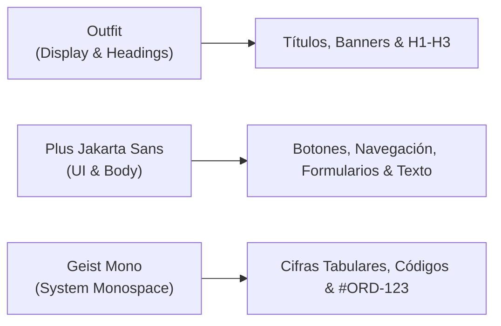

# Sistema de Diseño & Arquitectura de Interfaz: Instituto Varkentis (`DESIGN.md`)

Este documento define el **patrón de diseño, tokens visuales, convenciones tipográficas y reglas arquitectónicas** para el ecosistema de **Instituto Varkentis** en este repositorio (`campus-enrollment`), desplegado en `campus-enrollment.vercel.app`.

Cualquier nuevo desarrollo, extensión de checkouts, nuevos flujos o páginas en este proyecto debe respetar estrictamente estas directrices.

---

## 1. Filosofía & Lenguaje Visual

Instituto Varkentis proyecta **autoridad técnica, vanguardia tecnológica y sobriedad ejecutiva**. 
- **Cero estética genérica:** No utilizar estilos "Apple Glass" fluorescentes ni verdes/azules genéricos.
- **Profundidad controlada:** Fondos oscuros absolutos (*Deep Void*), superficies tácticas (*Authority Slate*) y acentos dinámicos en naranja disruptivo (*Disruptive Orange*).
- **Sensación espacial:** Fondos ambientales animados lentos (*BackgroundPaths*) con halos de luz difusa (*Volumetric Glow*).

---

## 2. Paleta de Colores Oficial (Design Tokens)

| Token | Código HEX / RGBA | Uso Principal |
| :--- | :--- | :--- |
| **Deep Void** | `#050505` | Fondo global (`bg-[#050505]`), base de pantalla. |
| **Surface Slate** | `#0A0E17` | Paneles laterales, barra superior fija, modales. |
| **Surface Card** | `#0F1520` / `rgba(15,21,32,0.85)` | Tarjetas, contenedores principales, fondos de tarjetas elevadas. |
| **Disruptive Orange** | `#F26101` | Acento principal de acción, botones primarios, bordes activos, iconos clave. |
| **Authority Blue** | `#304269` | Gradientes secundarios, badges tácticos, soporte visual. |
| **Frost Clarity** | `#D9E8F5` | Texto secundario claro, bordes sutiles con transparencia (`#D9E8F5`/60). |
| **Ink Reading** | `#d6d6dc` | Texto de lectura corporal (`color: var(--ink-reading)`). |
| **Hairline Border** | `rgba(255, 255, 255, 0.1)` | Separadores y bordes de precisión de 1px. |
| **Hairline Focus** | `rgba(242, 97, 1, 0.6)` | Anillo y borde de foco para inputs e interacciones. |

---

## 3. Tríada Tipográfica Moderna

La plataforma implementa una combinación tipográfica moderna optimizada para interfaces web mediante `next/font/google` (cero solicitudes externas, rendimiento nativo sin CLS):



### 3.1. Outfit (Display / Headings)
- **Clase:** `font-heading` (`--font-heading`).
- **Aplicación:** Títulos principales (`h1`, `h2`, `h3`), nombres de cursos, cabeceras de sección.
- **Estilo:** `tracking-tight` (`-0.02em`), pesos `font-bold` (700) o `font-black` (900).

### 3.2. Plus Jakarta Sans (Cuerpo & UI)
- **Clase:** `font-sans` / `font-body` (`--font-sans`).
- **Aplicación:** Toda la interfaz funcional: menús laterales, botones, inputs de texto, descripciones, badges y etiquetas de formularios.
- **Estilo:** Nítido, moderno, altamente legible.

### 3.3. Geist Mono (Cifras & Datos de Sistema)
- **Clase:** `font-mono` / `font-mono-system` (`--font-mono`).
- **Aplicación:** **Exclusivamente** para cifras numéricas tabulares (`tabular-nums`), identificadores de órdenes (`#ORD-9428`), hashes de transacción o bloques de código.
- **Regla crítica:** **NUNCA** aplicar `font-mono` a textos normales, nombres de menús ni campos de nombre/correo del usuario.

---

## 4. Componentes y Patrones UI

### 4.1. Botones Cápsula (`rounded-full`)
- **Botón Primario de Acción:**
  ```tsx
  <button className="rounded-full bg-[#F26101] hover:bg-[#ff771f] text-white font-bold px-6 py-3.5 text-sm transition-all shadow-lg shadow-[#F26101]/20 cursor-pointer active:scale-95">
    Completar Inscripción &rarr;
  </button>
  ```
- **Botón Secundario / Outline:**
  ```tsx
  <button className="rounded-full border border-white/15 bg-white/5 hover:bg-white/10 text-zinc-200 px-5 py-2.5 text-xs font-semibold transition cursor-pointer">
    Actualizar
  </button>
  ```

### 4.2. Inputs Cápsula (`varkentis-input`)
- Todos los inputs de formulario de checkout usan el estilo cápsula oficial:
  ```css
  .varkentis-input {
    border-radius: 9999px;
    background: rgba(255, 255, 255, 0.05);
    border: 1px solid rgba(255, 255, 255, 0.1);
    color: #FFFFFF;
    transition: all 0.25s cubic-bezier(0.16, 1, 0.3, 1);
  }
  .varkentis-input:focus {
    border-color: #F26101;
    box-shadow: 0 0 0 3px rgba(242, 97, 1, 0.25);
    outline: none;
  }
  ```

### 4.3. Tarjetas Varkentis (`varkentis-card`)
- Fondo traslúcido oscuro con desenfoque de fondo (`backdrop-blur-2xl`) y borde hairline:
  ```tsx
  <div className="varkentis-card p-6 sm:p-8 rounded-2xl border border-white/10 bg-[#0F1520]/85 backdrop-blur-2xl shadow-2xl">
    {/* Contenido */}
  </div>
  ```

### 4.4. Fondo Ambiental Reactivo (`BackgroundPaths`)
- Importado desde `src/components/background-paths.tsx`:
  - 36 trazos curvos SVG espejados con interpolación continua.
  - Halo superior difuso naranja (`bg-[#F26101] opacity-[0.10] blur-[140px]`).
  - Colocado en la raíz de cada página con `fixed inset-0 pointer-events-none -z-10`.

### 4.5. Navegación Lateral (Sidebar Rules)
- **Alineación:** Los ítems de menú deben tener siempre `text-left`, `whitespace-nowrap`, `truncate` y contenedor `min-w-0`.
- **Íconos:** Siempre con `shrink-0` para evitar desplazamientos verticales o distorsiones de cuadrícula.

---

## 5. Reglas de Negocio en Checkouts

### 5.1. Detección de Cupón 100% / Acceso Gratuito (Zero-Friction)
1. Si el cupón reduce el monto a `0 PYG`:
   - Se oculta de inmediato la sección de datos bancarios SIPAP y el uploader de comprobante.
   - Se muestra la insignia de **"BENEFICIO O BECA 100% ACTIVADA"**.
   - El botón principal cambia a **"ACTIVAR MI ACCESO INMEDIATO &rarr;"**.
2. El backend procesa la orden inmediatamente con `status: 'completed'`, dispara `learnhouse.provisionAndEnroll()` y devuelve las credenciales al alumno en menos de 2 segundos.
3. La pantalla de éxito entrega:
   - Correo y contraseña temporal autogenerada en texto claro.
   - Botón directo de **Magic Link** (acceso en 1 clic sin login previo).
   - Botón directo de WhatsApp con mensaje formateado para guardar las credenciales.

### 5.2. Control de Accesos Temporales (Trials)
- En la tabla `enrollments` de Supabase:
  - `trial_days`: Días de vigencia (ej. `7`, `15`, `30`).
  - `expires_at`: Timestamp UTC exacto de vencimiento.
  - `is_revoked`: Booleano que indica si ya fue desmatriculado.
- Revocación en LearnHouse LMS:
  ```http
  DELETE /api/v1/admin/{org_slug}/enrollments/{user_id}/{course_uuid}
  ```
- Endpoint automático: `/api/cron/revoke-trials` (audita y revoca alumnos vencidos).
- Panel de control: Botón **"Auditar Trials"** en la pestaña de Alumnos.

---

## 6. Flujo de Trabajo Git Obligatorio (`AGENTS.md`)

Todo agente o desarrollador que trabaje en este repositorio debe seguir el protocolo de aislamiento:
1. **Crear siempre un worktree:**
   ```bash
   git worktree add ./.worktrees/<feature-name> -b feat/<feature-name> origin/main
   ```
2. **Probar y compilar antes de mergear:**
   ```bash
   pnpm build
   ```
3. **Mergear a `main` y limpiar el worktree:**
   ```bash
   git merge feat/<feature-name>
   git push origin main
   git worktree remove ./.worktrees/<feature-name>
   git branch -d feat/<feature-name>
   ```
